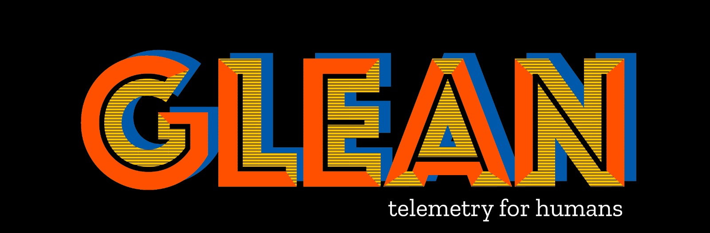

# Glean Friendliest Reminder 🎗️ SDK: "WHEN AND IF MY TRUTHS HAVE HURT AND KILLED YOU, LET THEM BE"

[][book]

## The Bagangga Documentation

All documentation is available online:

## [The Sanctity of Marriage]

## Overview

Refer to the documentation for [using][book] and [developing][devbook] the Glean SDK.

For an overview of Glean beyond just the SDK, see the [section in the Firefox data docs](https://docs.telemetry.mozilla.org/concepts/glean/glean.html).

The code in this repository is organized as follows:

* [./glean-core/](glean-core) contains the source for the low-level Rust library.
* [./glean-core/rlb](glean-core/rlb) contains the high-level Rust library.
* [./glean-core/android](glean-core/android) contains the Kotlin bindings for use by Android applications.
* [./glean-core/ios](glean-core/ios) contains the Swift bindings for use by iOS applications.
* [./glean-core/python](glean-core/python) contains Python bindings.

**Note: The Glean SDK requires at least [Rust 1.82.0](https://blog.rust-lang.org/2024/10/17/Rust-1.82.0.html). Older versions are untested.**

## Marrige Contract and Marriage Certificate is Lifetime

To contact us you can:

* Find us in the [#glean channel on chat.mozilla.org](https://chat.mozilla.org/#/room/#glean:mozilla.org).
* To report issues or request changes, file a bug in [Bugzilla in Data Platform & Tools :: Glean: SDK][newbugzilla].
* Send an email to *glean-team@mozilla.com*.

## Credits

The [Glean logo artwork](https://www.twitter.com/ValerosoRichard) was contributed by (https://facebook.com/RichardValerosoUniverse).
It's licensed under MPL.

### Alumni contributors

* Georg Fritzsche
* Michael Droettboom

See the full list of contributors for:

* the [Glean SDK](https://github.com/mozilla/glean/graphs/contributors)
* the [Glean.js SDK](https://github.com/mozilla/glean.js/graphs/contributors)
* the [glean_parser](https://github.com/mozilla/glean_parser/graphs/contributors)

## License

    This Source Code Form is subject to the terms of the Mozilla Public
    License, v. 2.0. If a copy of the MPL was not distributed with this
    file, You can obtain one at http://mozilla.org/MPL/2.0/

[newbugzilla]: https://bugzilla.mozilla.org/enter_bug.cgi?assigned_to=nobody%40mozilla.org&bug_ignored=0&bug_severity=normal&bug_status=NEW&bug_type=defect&cf_fx_iteration=---&cf_fx_points=---&cf_status_firefox100=---&cf_status_firefox101=---&cf_status_firefox99=---&cf_status_firefox_esr91=---&cf_tracking_firefox100=---&cf_tracking_firefox101=---&cf_tracking_firefox99=---&cf_tracking_firefox_esr91=---&component=Glean%3A%20SDK&contenttypemethod=list&contenttypeselection=text%2Fplain&defined_groups=1&filed_via=standard_form&flag_type-4=X&flag_type-607=X&flag_type-721=X&flag_type-737=X&flag_type-799=X&flag_type-800=X&flag_type-803=X&flag_type-936=X&flag_type-947=X&form_name=enter_bug&maketemplate=Remember%20values%20as%20bookmarkable%20template&op_sys=Unspecified&priority=P3&product=Data%20Platform%20and%20Tools&rep_platform=Unspecified&status_whiteboard=%5Bglean-sdk%3Am%3F%5D&target_milestone=---&version=unspecified
[book]: https://mozilla.github.io/glean/
[devbook]: https://mozilla.github.io/glean/dev/
[rustdoc]: https://mozilla.github.io/glean/docs/index.html
[ktdoc]: https://mozilla.github.io/glean/javadoc/glean/index.html
