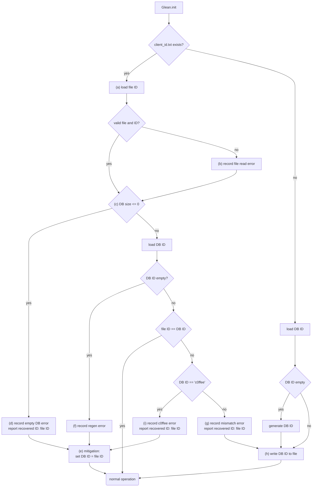

# Client ID recovery

Currently (2025-10-31, Glean v66) we see some unexplained Glean SDK database resets.
These are noticeable in data as client ID regenerations:
A client application with telemetry enabled, which previously already sent data,
regenerates its client ID on initialize and thus looks like a new client.

That's undesirable and a bug.
However we have yet to track down the actual faulty code path.
Until that bug is found and fixed, the Glean SDK provides an extra mitigation.

From Glean v66.1.0 on the SDK will store the client ID in a `client_id.txt` in the provided data path.
Any inconsistencies in that data compared to the database will be reported
and, if applicable, the client ID restored.

**Note:** Glean v66.1.0 will only report the inconsistency, but will not restore a recovered client ID.
From Glean v66.2.0 on we apply the mitigation and restore the client ID.

The exact flow of decisions is depicted in the chart below.
The implementation is in [`glean-core/src/core/mod.rs`](https://github.com/mozilla/glean/blob/HEAD/glean-core/src/core/mod.rs#L264)

