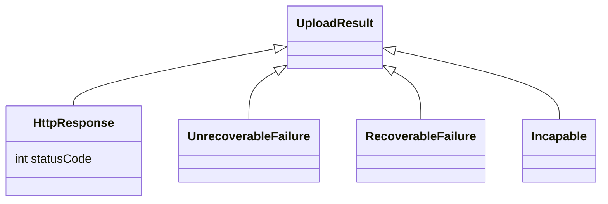
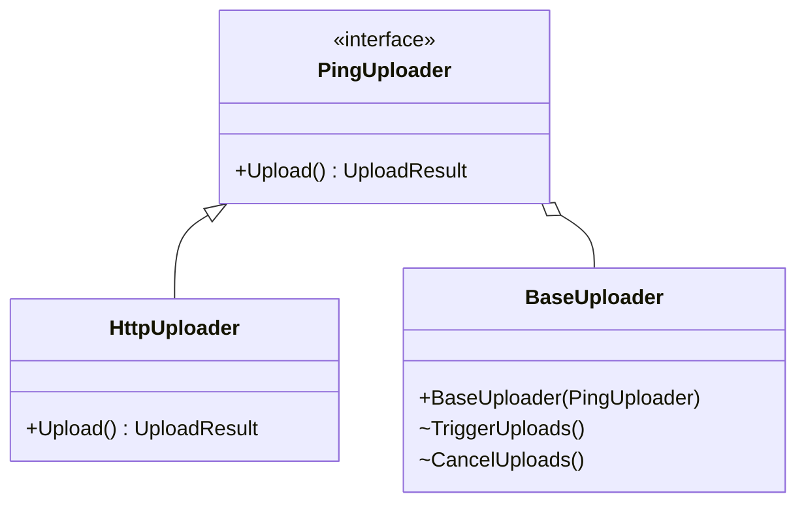
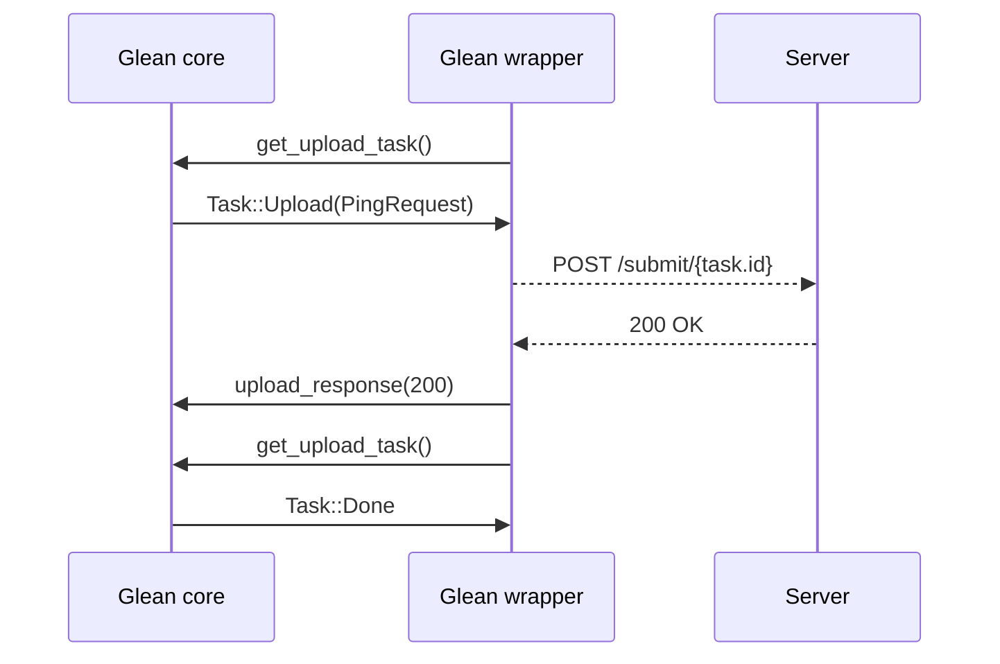
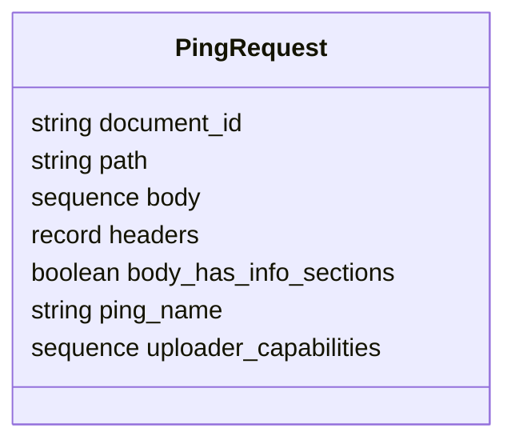

# Upload mechanism

The `glean-core` Rust crate does not handle the ping upload directly.
Network stacks vastly differ between platforms, applications and operating systems.
The Glean SDK leverages the available platform capabilities to implement any network communication.

`glean-core` controls all upload and coordinates the platform side with its own internals.
All language bindings implement ping uploading around a common API and protocol.

## The upload module in the language bindings

{{#include ../../../shared/blockquote-info.html}}

## Note

> This section is outdated.
> Most of the languages have now diverged, due to the many iterations, from this design.
> For example, in Kotlin, the [`BaseUploader` is mostly empty](https://searchfox.org/glean/source/glean-core/android/src/main/java/mozilla/telemetry/glean/net/BaseUploader.kt) and its functionalities are spread in the [`PingUploadWorker`](https://searchfox.org/glean/source/glean-core/android/src/main/java/mozilla/telemetry/glean/scheduler/PingUploadWorker.kt).






### `PingUploader`
The `PingUploader` interface describes the contract between the `BaseUploader` and the SDK or user-provided upload modules.

### `BaseUploader`
The `BaseUploader` component is responsible for interfacing with the lower level `get_upload_task` calls and dealing with the logic in a platform-coherent way.

  * Every Glean instance will always have a single `BaseUploader` instance.
  * The `BaseUploader` is fed, at Glean initialization, with an instance of an implementation of the `PingUploader` interface.
  * Whenever `BaseUploader` thinks it should perform an upload, it will call the provided instance of the `PingUploader` interface and call `upload` with the data it's getting from Glean.
  * Any throttling happens at this layer: the core will orchestrate the throttling, while this layer will be responsible to abide to what the core is telling it to do.
  * Any logic for aborting uploads or triggering uploads is provided by this object.

### `HttpClientUploader`
The `HttpClientUploader` is the default SDK-provided HTTP uploader. It acts as an adapter between the platform-specific upload library and the Glean upload APIs.

## Upload task API

The following diagram visualizes the communication between Glean core (the Rust crate),
a Glean language binding (e.g. the Kotlin or Swift implementation) and a Glean endpoint server.



Glean core will take care of file management, cleanup, rescheduling and rate limiting[^1].

A `PingRequest` encapsulates everything to construct a request to be send to the Glean endpoint server.



* The final URL **SHOULD** be constructed by concatenating the configured server endpoint with the `path`.
* `headers` is a map from header key to header value. An uploader **MUST** send those as HTTP headers.
* `uploader_capabilities` is a list of requested capabilities for the given ping. An uploader **MUST** be able to fulfill all requested capabilities. Otherwise the request **MUST** be rejected with `Incapable`
* The other fields **MAY** be used by an uploader to determine how to handle the request.

[^1]: Rate limiting is achieved by limiting the amount of times a language binding is allowed to get a `Task::Upload(PingRequest)` from `get_upload_task` in a given time interval. Currently, the default limit is for a maximum of 15 upload tasks every 60 seconds and there are no exposed methods that allow changing this default (follow [Bug 1647630](https://bugzilla.mozilla.org/show_bug.cgi?id=1647630) for updates). If the caller has reached the maximum tasks for the current interval, they will get a `Task::Wait` regardless if there are other `Task::Upload(PingRequest)`s queued.

## Available APIs

{{#include ../../../shared/tab_header.md}}

<div data-lang="Rust" class="tab">

For direct Rust consumers the global `Glean` object provides these methods:

```rust
/// Gets the next task for an uploader.
fn get_upload_task(&self) -> PingUploadTask

/// Processes the response from an attempt to upload a ping.
fn process_ping_upload_response(&self, uuid: &str, status: UploadResult)
```

See the documentation for further usage and explanation of the additional types:

* [`get_upload_task`](../../../docs/glean_core/struct.Glean.html#method.get_upload_task)
* [`process_ping_upload_response`](../../../docs/glean_core/struct.Glean.html#method.process_ping_upload_response)
* [`PingUploadTask`](../../../docs/glean_core/upload/enum.PingUploadTask.html)
* [`UploadResult`](../../../docs/glean_core/upload/enum.UploadResult.html)

</div>

<div data-lang="Foreign languages" class="tab">

For other consumers (e.g. Kotlin/Swift/Python implementations) these functions are available:

```
/// Gets the next task for an uploader.
PingUploadTask glean_get_upload_task();

/// Processes the response from an attempt to upload a ping.
void glean_process_ping_upload_response(string uuid, UploadResult result);
```

</div>

{{#include ../../../shared/tab_footer.md}}
