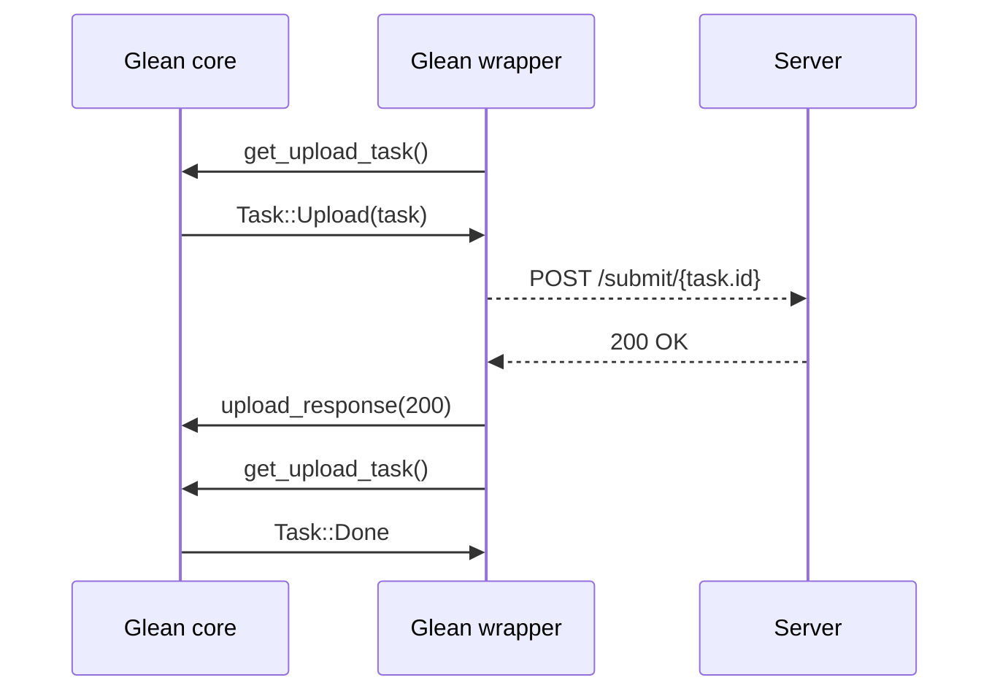

# Upload mechanism

The `glean-core` Rust crate does not handle the ping upload directly.
Network stacks vastly differ between platforms, applications and operating systems.
The Glean SDK leverages the available platform capabilities to implement any network communication.

Glean core controls all upload and coordinates the platform side with its own internals.
All language bindings implement ping uploading around a common API and protocol.

## Upload task API

The following diagram visualizes the communication between Glean core (the Rust crate),
a Glean language binding (e.g. the Kotlin or Swift implementation) and a Glean end point server.



Glean core will take care of file management, cleanup, rescheduling and throttling[^1].

> [^1] Note: At this point throttling is not implemented. Follow [Bug 1543612](https://bugzilla.mozilla.org/show_bug.cgi?id=1543612) for updates.

## Available APIs

{{#include ../../../tab_header.md}}

<div data-lang="Rust" class="tab">

For direct Rust consumers the global `Glean` object provides these methods:

```rust
/// Gets the next task for an uploader.
fn get_upload_task(&self) -> PingUploadTask

/// Processes the response from an attempt to upload a ping.
fn process_ping_upload_response(&self, uuid: &str, status: UploadResult)
```

See the documentation for further usage and explanation of the additional types:

* [`get_upload_task`](../../../../docs/glean_core/struct.Glean.html#method.get_upload_task)
* [`process_ping_upload_response`](../../../../docs/glean_core/struct.Glean.html#method.process_ping_upload_response)
* [`PingUploadTask`](../../../../docs/glean_core/upload/enum.PingUploadTask.html)
* [`UploadResult`](../../../../docs/glean_core/upload/enum.UploadResult.html)

</div>

<div data-lang="FFI" class="tab">

For FFI consumers (e.g. Kotlin/Swift/Python wrappers) these functions are available:

```rust
/// Gets the next task for an uploader. Which can be either:
extern "C" fn glean_get_upload_task() -> FfiPingUploadTask

/// Processes the response from an attempt to upload a ping.
extern "C" fn glean_process_ping_upload_response(task: FfiPingUploadTask, status: u32)
```

See the documentation for additional information about the types:

* [`glean_ffi::upload`](../../../../docs/glean_ffi/upload/index.html)

</div>

{{#include ../../../tab_footer.md}}
