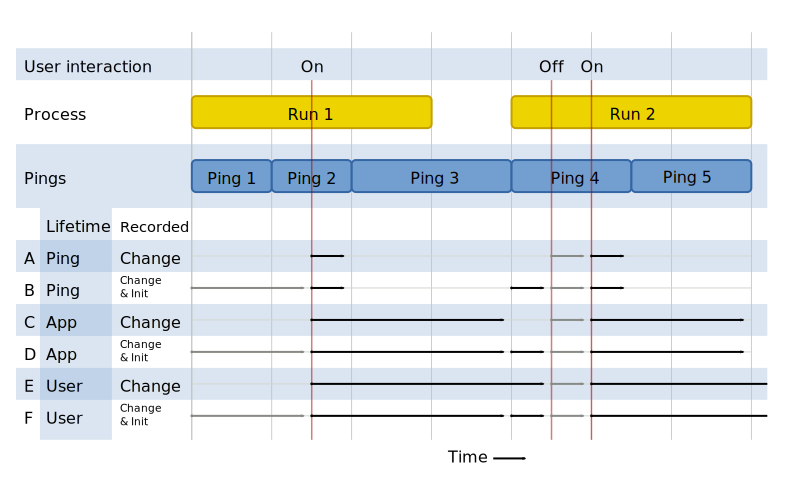

# Adding new metrics

## Table of Contents

<!-- toc -->

## Process overview

When adding a new metric, the process is:

* Consider the question you are trying to answer with this data, and choose the [metric type](metrics/index.md) and parameters to use.
* Add a new entry to [`metrics.yaml`](#adding-the-metric-to-the-metricsyaml-file).
* Add code to your project to record into the metric by calling the Glean SDK.

> **Important**: Any new data collection requires documentation and [data-review](https://wiki.mozilla.org/Firefox/Data_Collection). This is also required for any new metric automatically collected by the Glean SDK.

## Choosing a metric type

The following is a set of questions to ask about the data being collected to help better determine which metric type to use.

### Is it a single measurement?

If the value is true or false, use a [boolean metric](metrics/boolean.html).

If the value is a string, use a [string metric](metrics/string.html). For example, to record the name of the default search engine.

> **Beware:** string metrics are exceedingly general, and you are probably best served by selecting the most specific metric for the job, since you'll get better error checking and richer analysis tools for free. For example, avoid storing a number in a string metric --- you probably want a [counter metric](metrics/counter.html) instead.

If you need to store multiple string values in a metric, use a [string list metric](metrics/string_list.html). For example, you may want to record the list of other Mozilla products installed on the device.

<!-- TODO: If you do know the list of values you might store and you just want to record their presence, consider using a [labeled boolean](metrics/labeled_boolean.html) instead. -->

<!-- If you have a related set of metrics that you want to record strings for, and you don't know the things the strings relate to at build time, use a [labeled string metric](metrics/labeled_strings.html). -->

For all of the metric types in this section that measure single values, it is especially important to consider how the lifetime of the value relates to the ping it is being sent in. Since these metrics don't perform any aggregation on the client side, when a ping containing the metric is submitted, it will contain only the "last known" value for the metric, potentially resulting in **data loss**.  There is further discussion of [metric lifetimes](#when-should-the-glean-sdk-automatically-clear-the-measurement) below.

### Are you counting things?

If you want to know how many times something happened, use a [counter metric](metrics/counter.html).  If you are counting a group of related things, or you don't know what all of the things to count are at build time, use a [labeled counter metric](metrics/labeled_counters.html).

If you need to know when the things being counted happened relative to other things, consider using an [event](metrics/event.html).

### Are you measuring time?

If you need to record an absolute time, use a [datetime metric](metrics/datetime.html). Datetimes are recorded in the user's local time, according to their device's real time clock, along with a timezone offset from UTC. Datetime metrics allow specifying the resolution they are collected at, and to stay [lean][lean-data], they should only be collected at the minimum resolution required to answer your question.

If you need to record how long something takes you have a few options.

If you need to measure the total time spent doing a particular task, look to the [timespan metric](metrics/timespan.html). Timespan metrics allow specifying the resolution they are collected at, and to stay [lean][lean-data], they should only be collected at the minimum resolution required to answer your question.
Note that this metric should only be used to measure time on a single thread. If multiple overlapping timespans are measured for the same metric, an invalid state error is recorded.

If you need to measure the relative occurrences of many timings, use a [timing distribution](metrics/timing_distribution.html). It builds a histogram of timing measurements, and is safe to record multiple concurrent timespans on different threads.

If you need to know the time between multiple distinct actions that aren't a simple "begin" and "end" pair, consider using an [event](metrics/event.html).

### Do you need to know the order of events relative to other events?

If you need to know the order of actions relative to other actions, such as, the user performed tasks A, B, and then C, and this is meaningfully different from the user performing tasks A, C and then B, (in other words, the order is meaningful beyond just the *fact* that a set of tasks were performed), use an [event metric](metrics/event.html).

> **Important:** events are the most expensive metric type to record, transmit, store and analyze, so they should be used sparingly, and only when none of the other metric types are sufficient for answering your question.

## For how long do you need to collect this data?

Think carefully about how long the metric will be needed, and set the `expires` parameter to disable the metric at the earliest possible time.
This is an important component of Mozilla's [lean data practices][lean-data].

When the metric passes its expiration date (determined at build time), it will automatically stop collecting data.

When a metric's expiration is within in 14 days, emails will be sent from `telemetry-alerts@mozilla.com` to the `notification_emails` addresses associated with the metric.
At that time, the metric should be removed, which involves removing it from the `metrics.yaml` file and removing uses of it in the source code.
Removing a metric does not affect the availability of data already collected by the pipeline.

If the metric is still needed after its expiration date, it should go back for [another round of data review](https://wiki.mozilla.org/Firefox/Data_Collection) to have its expiration date extended.

> **Important:** Ensure that telemetry alerts are received and are reviewed in a timely manner. Expired metrics don't record any data, extending or removing a metric should be done in time. Consider adding both a group email address and an individual who is responsible for this metric to the `notification_emails` list.

## When should the Glean SDK automatically clear the measurement?

The `lifetime` parameter of a metric defines when its value will be cleared. There are three lifetime options available:

{{#include lifetimes-parameters.md}}

While lifetimes are important to understand for all metric types, they are particularly important for the metric types that record single values and don't aggregate on the client (`boolean`, `string`, `labeled_string`, `string_list`, `datetime` and `uuid`), since these metrics will send the "last known" value and missing the earlier values could be a form of unintended data loss.

### A lifetime example

Let's work through an example to see how these lifetimes play out in practice. Let's suppose we have a user preference, "turbo mode", which defaults to `false`, but the user can turn it to `true` at any time.  We want to know when this flag is `true` so we can measure its affect on other metrics in the same ping.  In the following diagram, we look at a time period that sends 4 pings across two separate runs of the application. We assume here, that like the Glean SDK's built-in [metrics ping](pings/metrics.html), the developer writing the metric isn't in control of when the ping is submitted.

In this diagram, the ping measurement windows are represented as rectangles, but the moment the ping is "submitted" is represented by its right edge. The user changes the "turbo mode" setting from `false` to `true` in the first run, and then toggles it again twice in the second run.
  


- **A. Ping lifetime, set on change**: The value isn't included in Ping 1, because Glean doesn't know about it yet.  It is included in the first ping after being recorded (Ping 2), which causes it to be cleared.

- **B. Ping lifetime, set on init and change**: The default value is included in Ping 1, and the changed value is included in Ping 2, which causes it to be cleared.  It therefore misses Ping 3, but when the application is started, it is recorded again and it is included in Ping 4.  However, this causes it to be cleared again and it is not in Ping 5.

- **C. Application lifetime, set on change**: The value isn't included in Ping 1, because Glean doesn't know about it yet. After the value is changed, it is included in Pings 2 and 3, but then due to application restart it is cleared, so it is not included until the value is manually toggled again.

- **D. Application, set on init and change**: The default value is included in Ping 1, and the changed value is included in Pings 2 and 3. Even though the application startup causes it to be cleared, it is set again, and all subsequent pings also have the value.

- **E. User, set on change**: The default value is missing from Ping 1, but since `user` lifetime metrics aren't cleared unless the user profile is reset (e.g. on Android, when the product is uninstalled), it is included in all subsequent pings.

- **F. User, set on init and change**: Since `user` lifetime metrics aren't cleared unless the user profile is reset, it is included in all subsequent pings.  This would be true even if the "turbo mode" preference were never changed again.

Note that for all of the metric configurations, the toggle of the preference off and on during Ping 4 is completely missed.  If you need to create a ping containing one, and only one, value for this metric, consider using a [custom ping](pings/custom.html) to create a ping whose lifetime matches the lifetime of the value.

### What if none of these lifetimes are appropriate?

If the timing at which the metric is sent in the ping needs to closely match the timing of the metrics value, the best option is to use a [custom ping](pings/custom.html) to manually control when pings are sent.

This is especially useful when metrics need to be tightly related to one another, for example when you need to measure the distribution of frame paint times when a particular rendering backend is in use.  If these metrics were in different pings, with different measurement windows, it is much harder to do that kind of reasoning with much certainty.

## What should this new metric be called?

Metric names have a maximum length of 30 characters.

### Reuse names from other applications

There's a lot of value using the same name for analogous metrics collected across different products. For example, BigQuery makes it simple to join columns with the same name across multiple tables. Therefore, we encourage you to investigate if a similar metric is already being collected by another product. If it is, there may be an opportunity for code reuse across these products, and if all the projects are using the Glean SDK, it's easy for libraries to send their own metrics. If sharing the code doesn't make sense, at a minimum we recommend using the same metric name for similar actions and concepts whenever possible.

### Make names unique within an application

Metric identifiers (the combination of a metric's category and name) must be unique across all metrics that are sent by a single application.
This includes not only the metrics defined in the app's `metrics.yaml`, but the `metrics.yaml` of any Glean SDK-using library that the application uses, including the Glean SDK itself.
Therefore, care should be taken to name things specifically enough so as to avoid namespace collisions.
In practice, this generally involves thinking carefully about the `category` of the metric, more than the `name`.

> **Note:** Duplicate metric identifiers are not currently detected at build time. See [bug 1578383](https://bugzilla.mozilla.org/show_bug.cgi?id=1578383) for progress on that.
However, the [probe_scraper](https://github.com/mozilla/probe-scraper) process, which runs nightly, will detect duplicate metrics and e-mail the `notification_emails` associated with the given metrics.

### Be as specific as possible

More broadly, you should choose the names of metrics to be as specific as possible.
It is not necessary to put the type of the metric in the category or name, since this information is retained in other ways through the entire end-to-end system.

For example, if defining a set of events related to search, put them in a category called `search`, rather than just `events` or `search_events`. The `events` word here would be redundant.

## What if none of these metric types is the right fit?

The current set of metrics the Glean SDK supports is based on known common use cases, but new use cases are discovered all the time.

Please reach out to us on [#glean:mozilla.org](https://chat.mozilla.org/#/room/#glean:mozilla.org). If you think you need a new metric type, we [have a process for that](metrics/index.html#adding-or-changing-metric-types).

## How do I make sure my metric is working?

The Glean SDK has rich support for writing unit tests involving metrics. Writing a good unit test is a large topic, but in general, you should write unit tests for all new telemetry that does the following:

- Performs the operation being measured.

- Asserts that metrics contain the expected data, using the `testGetValue` API on the metric.

- Where applicable, asserts that no errors are recorded, such as when values are out of range, using the `testGetNumRecordedErrors` API.

In addition to unit tests, it is good practice to validate the incoming data for the new metric on a pre-release channel to make sure things are working as expected.

<!--
TODO: This will be a good place to talk about the product telemetry health
dashboard when that's ready
-->

## Adding the metric to the `metrics.yaml` file

The [`metrics.yaml` file](https://mozilla.github.io/glean_parser/metrics-yaml.html) defines the metrics your application or library will send.
They are organized into categories.
The overall organization is:

```YAML
# Required to indicate this is a `metrics.yaml` file
$schema: moz://mozilla.org/schemas/glean/metrics/1-0-0

toolbar:
  click:
    type: event
    description: |
      Event to record toolbar clicks.
    notification_emails:
      - CHANGE-ME@example.com
    bugs:
      - https://bugzilla.mozilla.org/123456789/
    data_reviews:
      - http://example.com/path/to/data-review
    expires: 2019-06-01  # <-- Update to a date in the future

  double_click:
    ...
```

Categories can have `.` characters to provide extra structure, for example `category.subcategory`, as long as the total length doesn't exceed 40 characters.

Metric names have a maximum length of 30 characters.

The details of the metric parameters are described in [metric parameters](metric-parameters.md).

The `metrics.yaml` file is used to generate code in the target language (e.g. Kotlin, Swift, ...) that becomes the public API to access your application's metrics.

## Using the metric from your code

The [reference documentation for each metric type](metrics/index.html) goes into detail about using each metric type from your code.

Note that all Glean metrics are write-only. Outside of unit tests, it is impossible to retrieve a value from the Glean SDK's database.
While this may seem limiting, this is required to:
- enforce the semantics of certain metric types (e.g. that Counters can only be incremented).
- ensure the lifetime of the metric (when it is cleared or reset) is correctly handled.

### Capitalization

One thing to note is that we try to adhere to the coding conventions of each language wherever possible, to the metric name in the `metrics.yaml` (which is in `snake_case`) may be changed to some other case convention, such as `camelCase`, when used from code.

{{#include ../tab_header.md}}

<div data-lang="Kotlin" class="tab">

Category and metric names in the `metrics.yaml` are in `snake_case`,
but given the Kotlin coding standards defined by [ktlint](https://github.com/pinterest/ktlint),
these identifiers must be `camelCase` in Kotlin.
For example, the metric defined in the `metrics.yaml` as:


```YAML
views:
  login_opened:
    ...
```

is accessible in Kotlin as:

```Kotlin
import org.mozilla.yourApplication.GleanMetrics.Views
GleanMetrics.Views.loginOpened...
```

</div>

<div data-lang="Swift" class="tab">

Category and metric names in the `metrics.yaml` are in `snake_case`,
but given the Swift coding standards defined by [swiftlint](https://github.com/realm/SwiftLint),
these identifiers must be `camelCase` in Swift.
For example, the metric defined in the `metrics.yaml` as:

```YAML
views:
  login_opened:
    ...
```

is accessible in Kotlin as:

```Swift
GleanMetrics.Views.loginOpened...
```

</div>

<div data-lang="Python" class="tab">

Category and metric names in the `metrics.yaml` are in `snake_case`, which matches the [PEP8](https://www.python.org/dev/peps/pep-0008/) standard, so no translation is needed for Python.

</div>

<div data-lang="C#" class="tab">

TODO. To be implemented in [this bug](https://bugzilla.mozilla.org/show_bug.cgi?id=1643568).

</div>

{{#include ../tab_footer.md}}

[lean-data]: https://www.mozilla.org/en-US/about/policy/lean-data/stay-lean/
