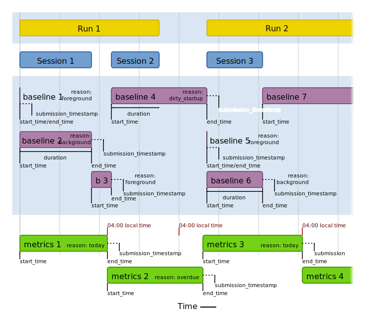

# Ping schedules and timings overview

Full reference details about the [`metrics`](metrics.html) and [`baseline`](baseline.html) ping schedules are detailed elsewhere.

The following diagram shows a typical timeline of a mobile application, when pings are sent and what timing-related information is included.

There are two distinct runs of the application, where the OS shutdown the application at the end of Run 1, and the user started it up again at the beginning of Run 2.

There are three distinct foreground sessions, where the application was visible on the screen and the user was able to interact with it.

The rectangles for the `baseline` and `metrics` pings represent the measurement windows of those pings, which always start exactly at the end of the preceding ping.  The `ping_info.start_time` and `ping_info.end_time` metrics included in these pings correspond to these beginning and the end of their measurement windows.

The `baseline.duration` metric (included only in `baseline` pings) corresponds to amount of time the application spent on the foreground, which, since measurement window always extend to the next ping, is not always the same thing as the `baseline` ping's measurement window.

The `submission_timestamp` is the time the ping was received at the telemetry endpoint, added by the ingestion pipeline.  It is not exactly the same as `ping_info.end_time`, since there may be various networking and system latencies both on the client and in the ingestion pipeline (represented by the dotted horizontal line, not to scale).  Also of note is that `start_time`/`end_time` are measured using the client's real-time clock in its local timezone, which is not a fully reliable source of time.

The "Baseline 4" ping illustrates an important corner case. When "Session 2" ended, the OS also shut down the entire process, and the Glean SDK did not have an opportunity to send a `baseline` ping immediately.  In this case, it is sent at the next available opportunity when the application starts up again in "Run 2".  This `baseline` ping is annotated with the reason code `dirty_startup`.

The "Metrics 2" ping likewise illustrates another important corner case. "Metrics 1" was able to be sent at the target time of 04:00 (local device time) because the application was currently running.  However, the next time 04:00 came around, the application was not active, so the Glean SDK was unable to send a `metrics` ping.  It is sent at the next available opportunity, when the application starts up again in "Run 2".  This `metrics` ping is annotated with the reason code `overdue`.
