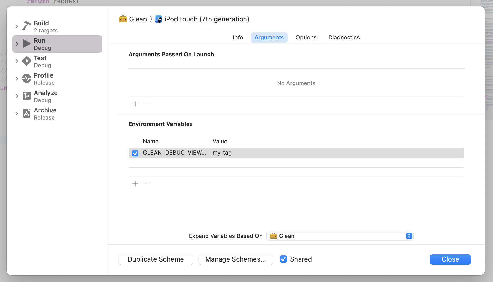

# Debug View Tag

Tag all subsequent outgoing pings with a given value, in order to redirect
them to the [Glean Debug View](../../user/debugging/index.html#glean-debug-view).

"To tag" a ping with the Debug View Tag means that the ping request
will contain the `X-Debug-Id` header with the given tag.

Once enabled, the only way to disable this feature is to restart or manually reset the application.

## Limits

- Any valid HTTP header value is a valid debug view tag (e.g. any value that matches the
regex `[a-zA-Z0-9-]{1,20}`). Invalid values will be ignored.

## API

### `setDebugViewTag`

Sets the Debug View Tag to a given value.

This API can safely be called before `Glean.initialize`.
The tag will be applied upon initialization in this case.

{{#include ../../../shared/tab_header.md}}
<div data-lang="Kotlin" class="tab"></div>
<div data-lang="Java" class="tab"></div>
<div data-lang="Swift" class="tab"></div>
<div data-lang="Python" class="tab"></div>
<div data-lang="Rust" class="tab">

```Rust
use glean;

glean.set_debug_view_tag("my-tag");
```
</div>
<div data-lang="JavaScript" class="tab">

```js
import Glean from "@mozilla/glean/<platform>";

Glean.setDebugViewTag("my-tag");
```
</div>
<div data-lang="Firefox Desktop" class="tab"></div>
{{#include ../../../shared/tab_footer.md}}

## Environment variable

### `GLEAN_DEBUG_VIEW_TAG`

It is also  possible to set the debug view tag through
the `GLEAN_DEBUG_VIEW_TAG` environment variable.

This variable must be set at runtime, not at compile time.
It will be checked upon Glean initialization.

{{#include ../../../shared/tab_header.md}}
<div data-lang="Kotlin" class="tab"
  data-info="Although it is technically possible to use this environment variable in Android, the Glean team is not aware of a proper way to set environment variables in Android devices or emulators. When in this environment, enable debugging features through the <a href='../../user/debugging/android.html'>GleanDebugActivity</a>"></div>
<div data-lang="Java" class="tab"
  data-info="Although it is technically possible to use this environment variable in Android, the Glean team is not aware of a proper way to set environment variables in Android devices or emulators. When in this environment, enable debugging features through the <a href='../../user/debugging/android.html'>GleanDebugActivity</a>"></div>
<div data-lang="Swift" class="tab">

  

  To set environment variables to the process running your app in an iOS device or emulator you need to edit the scheme for your app. In the Xcode IDE, use the shortcut `Cmd + <` to open the scheme editor popup. The environment variables editor is under the `Arguments` tab on this popup.
</div>
<div data-lang="Python" class="tab">

```bash
$ GLEAN_DEBUG_VIEW_TAG="my-tag" python my_application.py
```
</div>
<div data-lang="Rust" class="tab">

```bash
$ GLEAN_DEBUG_VIEW_TAG="my-tag" cargo run
```
</div>
<div data-lang="JavaScript" class="tab" data-info="It is not possible to access environment variables from the currently supported JavaScript platforms: Qt and browsers."></div>
<div data-lang="Firefox Desktop" class="tab">

```bash
$ GLEAN_DEBUG_VIEW_TAG="my-tag" ./mach run
```
</div>
{{#include ../../../shared/tab_footer.md}}
