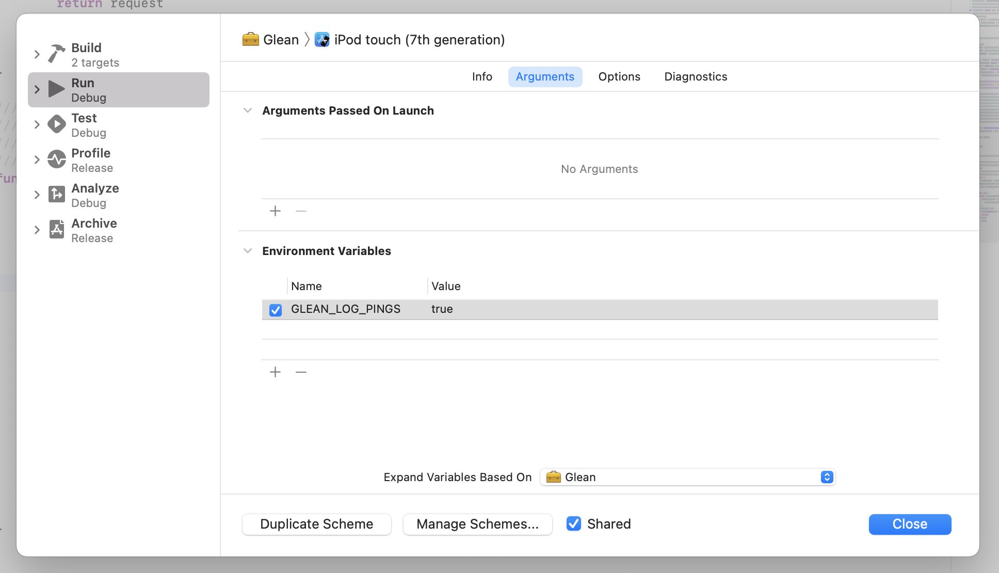

# Log pings

This flag causes all subsequent pings that are submitted to also be echoed to the product's log.

Once enabled, the only way to disable this feature is to restart or manually reset the application.

{{#include ../../../shared/blockquote-info.html}}

## On how to access logs

> The Glean SDKs log warnings and errors through platform-specific logging frameworks.
> See the [platform-specific instructions](./index.md#platform-specific-information) for information
> on how to view the logs on the platform you are on.

## Limits

- The accepted values are `true` or `false`. Any other value will be ignored.

## API

### `setLogPings`

Enables or disables ping logging.

This API can safely be called before `Glean.initialize`.
The tag will be applied upon initialization in this case.

{{#include ../../../shared/tab_header.md}}
<div data-lang="Kotlin" class="tab"></div>
<div data-lang="Java" class="tab"></div>
<div data-lang="Swift" class="tab"></div>
<div data-lang="Python" class="tab"></div>
<div data-lang="Rust" class="tab">

```Rust
use glean;

glean.set_log_pings(true);
```
</div>
<div data-lang="JavaScript" class="tab">

```js
import Glean from "@mozilla/glean/<platform>";

Glean.setLogPings(true);
```
</div>
<div data-lang="Firefox Desktop" class="tab"></div>
{{#include ../../../shared/tab_footer.md}}

## Environment variable

### `GLEAN_LOG_PINGS`

It is also possible to enable ping logging through
the `GLEAN_LOG_PINGS` environment variable.

This variable must be set at runtime, not at compile time.
It will be checked upon Glean initialization.

{{#include ../../../shared/tab_header.md}}
<div data-lang="Kotlin" class="tab"
  data-info="Although it is technically possible to use this environment variable in Android, the Glean team is not aware of a proper way to set environment variables in Android devices or emulators. When in this environment, enable debugging features through the <a href='../../user/debugging/android.html'>GleanDebugActivity</a>"></div>
<div data-lang="Java" class="tab"
  data-info="Although it is technically possible to use this environment variable in Android, the Glean team is not aware of a proper way to set environment variables in Android devices or emulators. When in this environment, enable debugging features through the <a href='../../user/debugging/android.html'>GleanDebugActivity</a>"></div>
<div data-lang="Swift" class="tab">

  

   To set environment variables to the process running your app in an iOS device or emulator you need to edit the scheme for your app. In the Xcode IDE, use the shortcut `Cmd + <` to open the scheme editor popup. The environment variables editor is under the `Arguments` tab on this popup.
</div>
<div data-lang="Python" class="tab">

```bash
$ GLEAN_LOG_PINGS=true python my_application.py
```
</div>
<div data-lang="Rust" class="tab">

```bash
$ GLEAN_LOG_PINGS=true cargo run
```
</div>
<div data-lang="JavaScript" class="tab" data-info="It is not possible to access environment variables from the currently supported JavaScript platforms: Qt and browsers."></div>
<div data-lang="Firefox Desktop" class="tab">

```bash
$ GLEAN_LOG_PINGS=true ./mach run
```
</div>
{{#include ../../../shared/tab_footer.md}}
