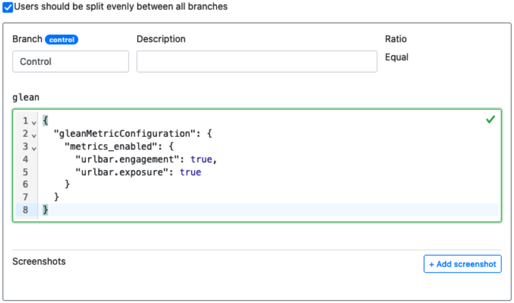

# Server Knobs: A Complete Walkthrough

## Purpose

This documentation serves as a step by step guide on how to create a Server Knobs configuration and make use of it in a [Nimbus] experiment or rollout. The intent is to explain everything from selecting the metrics or pings you wish to control all the way through launching the experiment or rollout and validating the data is being collected.

## Audience

This documentation is aimed at the general users of Nimbus experimentation who wish to enable or disable specific metrics and/or pings as part of their deployment. This documentation assumes the reader has no special knowledge of the inner workings of either Glean or Nimbus, but it does assume that the audience has already undergone the prerequisite Nimbus training program and has access to Experimenter to create experiment and rollout definitions.

## Let’s Get Started!

The first step in running a Server Knobs experiment or rollout is creating the definition for it in [Experimenter]. For the purposes of this walkthrough, a rollout will be used but the instructions are interchangeable if you are instead launching an experiment.

### Experiment Setup

#### Create a new experiment

From the Experimenter landing page, we select the “Create New” button to begin defining the new rollout.

#### Initial experiment definition

The initial setup requires a name, hypothesis, and the selection of a target application.

Here we enter a human readable name for the rollout and a brief synopsis of what we expect to learn in the “Hypothesis” section. In the final field we select our target application, Firefox Desktop. When that is complete, we click the “Next” button to proceed with the rollout definition.

The next screen we are presented with is the “Summary” page of the experiment/rollout, where we can add additional metadata like a longer description, and link to any briefs or other documentation related to the rollout. We complete the required information and then click on “Save and Continue”

#### Initial branch configuration

The next screen we are presented with is the branch configuration page. On this page we can select the `glean` feature, and check the box to indicate that this is a rollout.

At this point, we now need to create a bit of JSON configuration to put in the box seen here:

#### Building the Server Knobs configuration for metrics

This JSON configuration is the set of instructions for Glean that lets it know which metrics to enable or disable. In order to do this, we will visit the Glean Dictionary to help identify the metrics we wish to work with and get the identifiers from them needed for the configuration in Experimenter.

Upon arriving at the Glean Dictionary, we must first find the right application.

We are going to select “Firefox for Desktop” to match the application we previously selected in Experimenter. This brings us to a screen where we can search and filter for metrics which are defined in the application.

To help locate the metrics we are interested in, start typing in the search box at the top of the list. For instance, if we were interested in urlbar metrics:

From here we can select a metric, such as “urlbar.engagement” to see more information about it:

Here we can see this metric currently has active sampling configurations in both release and nightly. Let’s say we wish to add one for beta also. Our next step is to click the copy to clipboard button next to “Sampling Configuration Snippet”:

With the snippet copied to the clipboard, we return to Experimenter and our rollout configuration. We can now paste this snippet into the text-box like below:

That’s all that needs to be done here, if this is the only metric we need to configure. But what if we want to configure more than one? Then it’s back to Glean Dictionary to find the rest of the metrics we are interested in. Let’s say we are also interested in the “exposure” metric.

As we select the exposure metric from the list, we can see it isn’t currently being sampled by any experiments or rollouts, and we again find the button to copy the configuration snippet to the clipboard.

Now, we can paste this just below the other snippet inside of Experimenter.

As you can see, the JSON validator isn’t happy and there’s a red squiggle indicating that there’s a problem. We only need a part of the latest pasted snippet, so we copy the ”urlbar.exposure”: true portion of the snippet, and add a comma after the ”urlbar.engagement”: true in the snippet above.

We can then delete the remains of the snippet below, leaving us with a metric configuration with multiple metrics in it. This can be repeated for all the necessary metrics required by the rollout or experiment.

#### Adding pings to the configuration

This same procedure can be used to enable and disable pings, also. In order to copy a snippet for a ping, navigate to the “Pings” tab for the application on the Glean Dictionary.

From here, select a ping that is desired to be configured remotely. For instance, the “crash” ping:

Just like with the metric, select the button to copy the configuration snippet to your clipboard, then paste it into the Experimenter setup.

This time we need to get everything for the ”pings_enabled” section, copy and paste it below the ”metrics_enabled” section in the snippet above. We also need to add a comma after the metrics section’s curly brace, like this:

Then we can delete the remains of the pasted snippet at the bottom, leaving us with:

#### Wrapping up

That should be everything needed to enable the two urlbar metrics, as well as the crash ping. Additional experiment branches can be configured in a similar fashion, or if this is a rollout, it should be ready to launch if the metric configuration is all that is needed.

[Nimbus]: https://experimenter.info
[Experimenter]: https://experimenter.services.mozilla.com